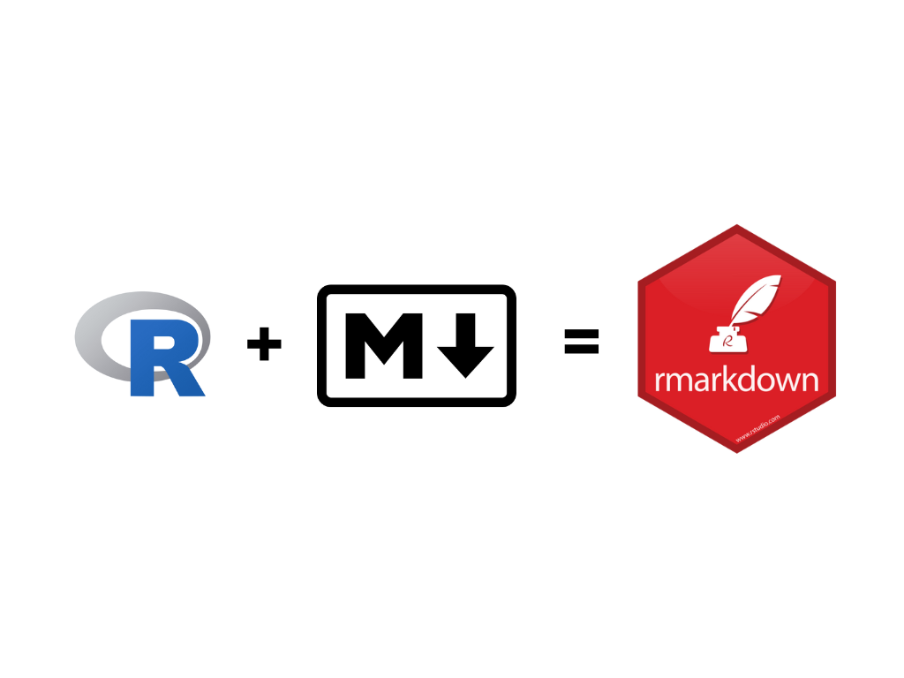
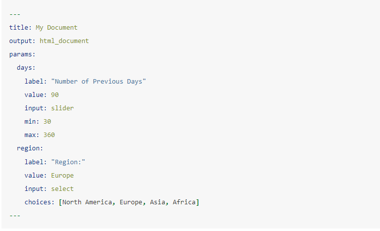
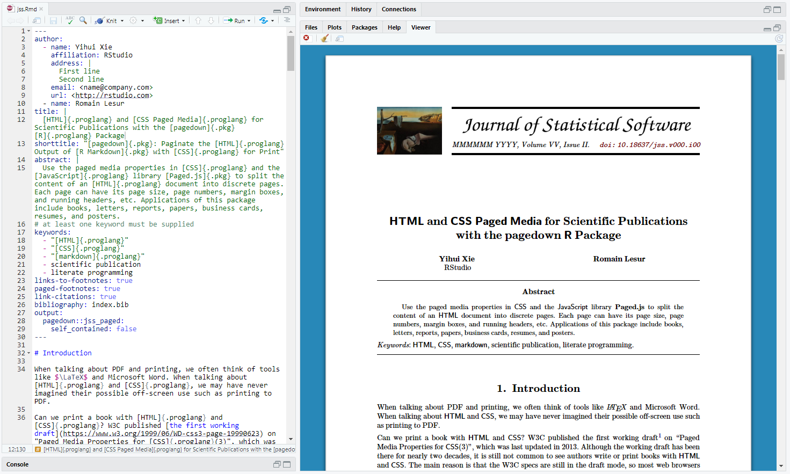
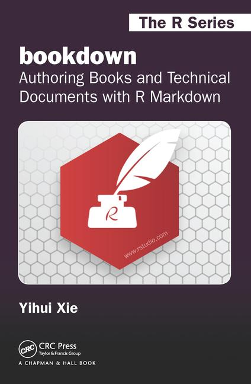
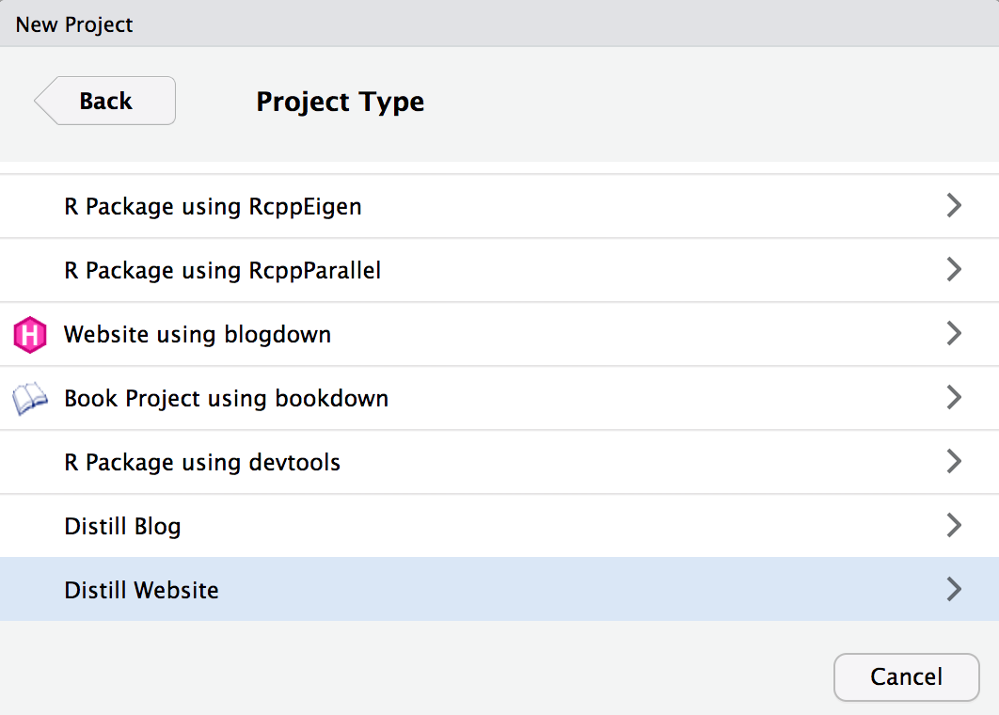
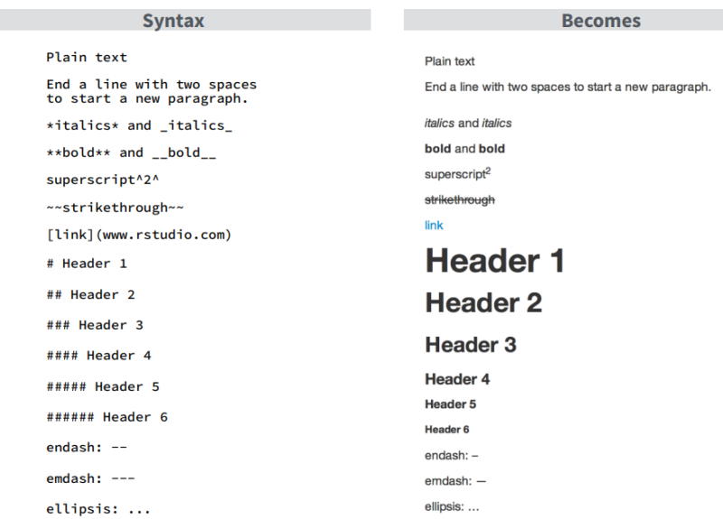
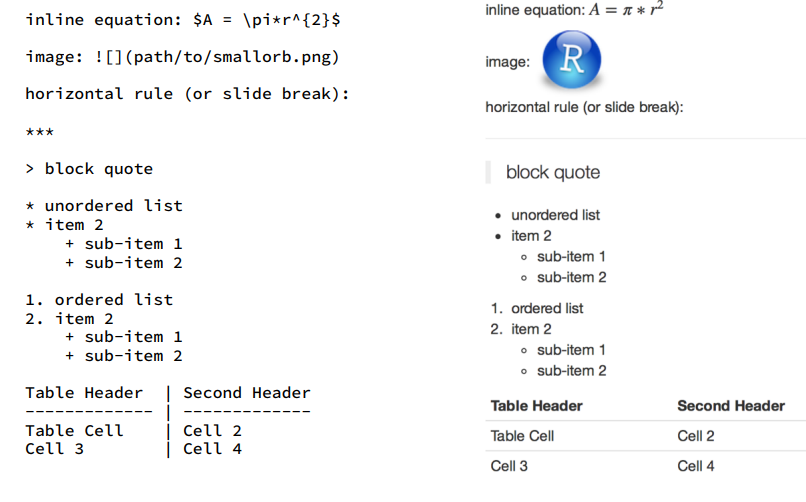
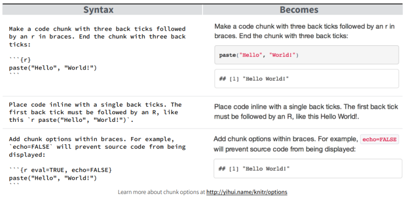
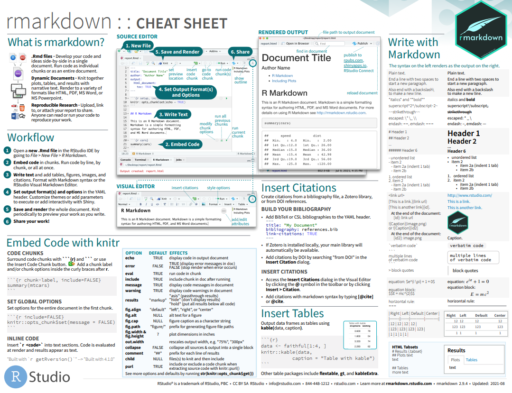

```{r setup, include=FALSE}
knitr::opts_chunk$set(echo = FALSE)

library(palmerpenguins)
library(knitr)
library(tidyverse)

```


## What is R Markdown

> R Markdown (.Rmd) is an authoring format that enables easy creation of dynamic documents, presentations, and reports from R. 
It combines the core syntax of markdown (an easy to write plain text format) with embedded R code chunks that are run so their output can be included in the final document. 
R Markdown documents are fully reproducible (they can be automatically regenerated whenever underlying R code or data changes).” – [RStudio documentation](http://rmarkdown.rstudio.com/).


## Why R Markdown?| for Open Science

- Transparency
- Availability
- Accessibility
- Collaboration


## Why R Markdown?| for your work

There are many advantages to using R Markdown in your work:

- Human readable 
- Simple syntax 
- A Reminder for Your Future Self 
- Easy to Modify
- Flexible export formats 
- Easy to share


## R + Markdown

```{r}


```


## How it works {data-background="images/workflow.png" data-background-size=90%}


## Output formats

Write a single `.Rmd` file and then use it to render finished output in a variety of formats

```{r}
include_graphics("images/rmarkdown_universe.jpg")
```


## Add Code and Results

````r
```{r table2}`r ''`
penguins %>% 
  select(species, bill_length_mm:flipper_length_mm) %>% 
  gtsummary::tbl_summary(by = species, missing = "no") %>% 
  gtsummary::modify_caption("Flipper/Bill size by Species") %>% 
  gtsummary::as_flex_table()

```
````

```{r table2, fig.cap = "Descritives by Species", fig.width=7, message=FALSE, warning=FALSE}
penguins %>% 
  select(species, bill_length_mm:flipper_length_mm) %>% 
  gtsummary::tbl_summary(
    by = species,
    missing = "no"
  ) %>% 
  gtsummary::modify_caption("Flipper/Bill size by Species") %>% 
  gtsummary::as_flex_table()

```


## Add Text and reference to Plots

in Figure \@ref(fig:corr-plot) we see examples of plotting in R.

```{r corr-plot, fig.cap="Correlation Plot", fig.width=7, message=FALSE, warning=FALSE}

penguins %>% 
  ggplot(aes(bill_length_mm, bill_depth_mm))+
  geom_point(aes(color= species), size = 2)+
  geom_smooth(method = "lm", colour = "black")+
  geom_smooth(method = "lm", aes(color = species))+
  labs(x="Bill Length", y="Bill Depth", title="Bill Depth as a function of Bill Length")+
  theme_minimal()
  
```

## Embed a picture

```{r picture, out.width=500}
knitr::include_graphics("images/palmer-penguins.png")
```
Artwork by @allison_horst

## Embed a Youtube video

```{r}

vembedr::embed_youtube("zNzZ1PfUDNk", height = 280)

#{width="560" height="315"}
```


## Parameterised reports

Will show live in a while

```{r parameterised}

```


## Use it for| __Reproducible data analysis__
[NYT interactive Rmakrdown document](http://timelyportfolio.github.io/rCharts_nyt_home_price/)
<video width="400" height="300" controls>
  <source src="images/vid-reproducible.mp4" type="video/mp4">
</video>

## Use it for __Writing papers/articles__

Use the [Pagedown Package](https://pagedown.rbind.io/)

See an example [here](https://pagedown.rbind.io/thesis-paged)

```{r, fig.cap=""}

```

## Use it for __Authoring books__

[https://bookdown.org/](https://bookdown.org/)

<video width="400" height="300" controls>
  <source src="images/vid-bookdown.mp4" type="video/mp4">
</video>


## Use it for __Authoring books__|Techincal documentation and instructions

[Bookdown book](https://bookdown.org/yihui/bookdown/).    
It's __free__     

```{r, fig.cap=""}

```

## Use it for __Creating websites__

Techincal documentation and instructions in the [Blogdown book](https://bookdown.org/yihui/blogdown/).    
It's __free__     

```{r, fig.cap=""}
knitr::include_graphics("images/cover-blogdown.png")
```

## Use it for __Creating websites__| More tools (and simpler)

- [Distill for R Markdown](https://rstudio.github.io/distill/)

```{r, fig.cap=""}

```
<!-- {width=50%} -->


## Syntax 1/3

Get the full reference guide [at R Studio website](https://www.rstudio.com/wp-content/uploads/2015/03/rmarkdown-reference.pdf)



## Syntax 2/3



## Syntax 3/3



## Resources - Authoring Rmarkdown|Courses/Workshops

All these are with slides/code/data/examples and structured. Also, FREE

- [Earth Data Analytics](https://www.earthdatascience.org/courses/earth-analytics/document-your-science/about-open-science-and-why-open-science-is-important/) (very good)
- [RMarkdown course ISGlobal](https://github.com/maelle/rmd_course_isglobal)
- [Osaka City University](https://github.com/jenniferthompson/RepResearchRMarkdown
)
- [Emi Tanaka](https://github.com/emitanaka/combine2019)
- [Advanced R Markdown Workshop](https://arm.rbind.io/)
- [Alison Hill-1](https://github.com/rstudio-education/arm-workshop-rsc2019) (Very good)
- [Alison Hill-2](https://github.com/rstudio-education/rmd4medicine)


## Resources - Authoring Rmarkdown|Tips/ Cookbooks

- [Rmarkdown Cookbook](https://bookdown.org/yihui/rmarkdown-cookbook/)
- [Rmakrdown for scientists](RMarkdown for Scientists)
- [Yan Holtz](https://holtzy.github.io/Pimp-my-rmd/)
- [Keith McNulty](https://towardsdatascience.com/five-r-markdown-tricks-that-you-may-not-know-about-71e93f50c026)

## Resources|Websites with Rmarkdown

- [Distill for R Markdown](https://rstudio.github.io/distill/)
- [The Distillery](https://distillery.rbind.io/) (really usefull)
- [Alison hill](https://www.apreshill.com/)
- [Tom Mock](https://themockup.blog/)
- [Yuzar](https://yuzar-blog.netlify.app/)
- [Distill CSS defaults](https://github.com/rstudio/distill/blob/6be30c96dc469fcc0e3799d23ddfaac72c2a6466/inst/rmarkdown/templates/distill_article/resources/distill.html)
- [Mike Frank](https://libscie.github.io/rmarkdown-workshop/handout.html)

- [Showcase of Rmarkdown distill websites](https://distillery.rbind.io/showcase.html)


## Need more help?

> Help > Cheatsheets > R MarkdownCheatSheet

{width=80%}

## Need more help?|Cheatsheet

{width=60%}


## Thank you

Lefkios Paikousis    
Statistician    
[lefkios@improvast.com](lefkios@improvast.com)    

You can find the slides at [my Github](https://github.com/lefkiospaikousis/Conference-May2022)

